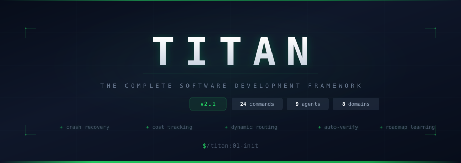

<p align="center">
  
</p>

<p align="center">
  <strong>One person + TITAN = software that competes with teams of hundreds.</strong>
</p>

<p align="center">
  <a href="#installation"></a>
  <a href="LICENSE"></a>
  
  
  
  
</p>

---

## The Problem

You're one person. You have an idea. You want to build it *right* — not a prototype that falls apart, not a hack you'll rewrite in three months. You want software that works, that's verified, that you'd be proud to show anyone.

But the way AI-assisted development works today is: you prompt, you get code, you hope it's good. Nobody checks. Nobody tracks what was planned vs what was built. Nobody catches the bug that your tests don't cover. When your session crashes, you start over. When your budget runs out, you find out from your credit card statement.

TITAN fixes all of this.

---

## What TITAN Actually Does

TITAN is a development system that runs inside **Claude Code** (or **OpenCode**). You install it once, and it gives you 24 slash commands that manage your entire project lifecycle.

| | |
|:--|:--|
| **Verifies everything. Twice.** | Two independent AI reviewers per phase. One checks spec compliance. One checks code quality. Both must find at least one issue or they review harder. |
| **Recovers from crashes.** | Lock files track every committed task. Session dies? Type "continue" and pick up exactly where you left off. |
| **Tracks what things cost.** | Per-task metrics. Running totals. Budget ceilings with enforcement. You always know what you're spending. |
| **Routes models by complexity.** | Simple tasks get cheap models. Complex tasks get Opus. Automatic. 40-60% cost savings. |
| **Catches errors immediately.** | Configure `npm test` or `cargo check`. Runs after every task. Auto-fixes failures before you hear about it. |
| **Learns from what it builds.** | After each phase, the roadmap is reassessed against what was learned. No building on stale assumptions. |
| **Solves novel problems.** | `/titan:investigate` for hypothesis generation. `/titan:experiment` for isolated prototyping. Structured research, not guesswork. |

---

## The Golden Path

9 steps. Follow them in order. Repeat 06-08 for each phase.

```
  01 INIT ──> 02 VISION ──> 03 BOOTSTRAP ──> 04 EXPLORE ──> 05 DESIGN
                                                                  |
  09 SHIP <── 08 VERIFY <── 07 BUILD <──────────────────── 06 PLAN
                  |                                          |
                  '──────────── repeat 06->08 ───────────────'
                                for each phase
```

| Step | Command | What Happens |
|:----:|---------|-------------|
| `01` | `/titan:01-init` | Scaffold the project. Detect greenfield or brownfield. Configure your domain. |
| `02` | `/titan:02-vision` | Three AI personas interview you — Visionary, Product Strategist, Technical Architect. You walk out with a vision doc, requirements with BDD acceptance criteria, a system architecture, and a phased roadmap. |
| `03` | `/titan:03-bootstrap` | Create the autonomous scaffold — MANIFEST, init.sh, docs, prompts. Run once for loop-driven development. |
| `04` | `/titan:04-explore` | Research what you don't know. Prior art, technology evaluation, risk mapping. |
| `05` | `/titan:05-design` | Design your UI through conversation. Get real HTML/CSS mockups you can open in a browser and iterate on. |
| `06` | `/titan:06-plan` | A researcher agent scans your codebase, then TITAN builds a task-level execution plan with waves, boundaries, and acceptance criteria. |
| `07` | `/titan:07-build` | The thin orchestrator dispatches parallel agents — each in a fresh 200k-token context window. One task = one commit. Verification commands run after each task. Cost tracked per task. Crash recovery active. |
| `08` | `/titan:08-verify` | Mandatory 3-part gate: reconciliation (plan vs reality), two-stage adversarial review (spec + quality), and knowledge capture. Then reassess the roadmap based on what you learned. |
| `09` | `/titan:09-ship` | Pre-flight checklist. Merge branches. Tag release. Archive phase data. Cost report. Done. |

---

## 9 Specialized Agents

Each agent runs in a clean context window. No inherited fatigue. No accumulated garbage.

| Agent | What It Does |
|:------|:------------|
| **Executor** | Implements tasks from plans. Follows spec literally. One task = one atomic commit. Reports structured status (DONE / DONE_WITH_CONCERNS / NEEDS_CONTEXT / BLOCKED). |
| **Verifier** | Two-stage adversarial review. Stage A: does the code match the spec? Stage B: is the code well-written? Must find at least one issue per stage — no rubber-stamping. |
| **Researcher** | Scans your codebase before planning. Maps files, patterns, conventions, boundaries, risks. |
| **Designer** | Generates complete, browser-testable HTML/CSS mockups. Responsive. Accessible. Interactive states via CSS. |
| **Investigator** | Novel problem solver. Generates minimum 3 distinct hypotheses. Evaluates against criteria. Produces evidence-based recommendations. |
| **Strategist** | System-level architecture advisor. Evaluates approaches across scalability, performance, maintainability, complexity, and DX. |
| **Security** | OWASP Top 10. Supply chain. Secrets detection. Dangerous code patterns. Spawned proactively after risky changes. |
| **Optimizer** | Performance bottleneck analysis. Algorithmic complexity. Memory leaks. I/O patterns. Domain-specific (bundle size for web, frame budget for games, real-time safety for audio). |
| **Tester** | Test generation and TDD support. 60% happy path, 25% edge cases, 15% error paths. Framework-agnostic. |

---

## Domain-Aware Quality

TITAN doesn't treat a web app the same as an audio plugin. Configure your domain and quality checks adapt automatically.

```yaml
# .titan/config.yaml
domain:
  primary: web    # web | mobile | desktop | audio | game | data | api | infrastructure
```

Each domain defines what "quality" means for your kind of software:
- **Web**: accessibility (WCAG 2.1 AA), responsive design, XSS prevention, Core Web Vitals
- **Audio**: real-time safety, buffer management, denormal protection, latency budgets
- **Mobile**: battery impact, offline handling, platform guidelines
- **API**: input validation, rate limiting, auth patterns, error responses
- **Game**: frame budgets, memory management, input latency

8 domains ship with TITAN. Create your own with a single YAML file.

---

## Power Tools

Use these anytime, outside the Golden Path.

<table>
<tr>
<td width="50%" valign="top">

### Solve Hard Problems

| Command | Purpose |
|---------|---------|
| `/titan:investigate` | Systematic novel problem analysis |
| `/titan:experiment` | Isolated prototyping + comparison |
| `/titan:learn` | Deep research on any technology |
| `/titan:debug` | Scientific debugging with hypothesis tracking |

### Analyze & Improve

| Command | Purpose |
|---------|---------|
| `/titan:scan` | Deep codebase analysis (4 parallel agents) |
| `/titan:review` | On-demand adversarial code review |
| `/titan:audit` | Security + performance + accessibility |
| `/titan:refactor` | Safe refactoring, tests preserved |
| `/titan:test` | Generate tests, TDD workflows |
| `/titan:quick` | Small task, full quality guarantees |

</td>
<td width="50%" valign="top">

### Session Management

| Command | Purpose |
|---------|---------|
| `/titan:resume` | Pick up where you left off (+ crash recovery) |
| `/titan:pause` | Save state + handoff document |
| `/titan:progress` | Dashboard: phases, costs, blockers, next action |
| `/titan:autopilot` | Auto-run plan/build/verify per phase |
| `/titan:settings` | Configure everything |
| `/titan:help` | Command reference |

### Autonomous Development (v2.0)

| Command | Purpose |
|---------|---------|
| `/titan:03-bootstrap` | Create autonomous scaffold |
| `/titan:loop-start` | Start feature-driven autonomous loop |
| `/titan:loop-status` | Loop health + progress |
| `/titan:loop-stop` | Graceful stop |
| `/titan:verify-e2e` | End-to-end feature verification |

</td>
</tr>
</table>

---

## What v2.1 Added (from GSD-2)

We studied the [GSD-2 framework](https://github.com/gsd-build/gsd-2) — a standalone TypeScript CLI for autonomous AI development — and integrated its best ideas into TITAN's architecture.

| Feature | What It Does | Config |
|---------|-------------|--------|
| **Dynamic model routing** | Classifies tasks as light/standard/heavy, routes to cost-appropriate models. 40-60% cost reduction. | `dynamic_routing.enabled: true` |
| **Verification commands** | Auto-runs lint/test after every task. Auto-fixes failures. | `verification.commands: ["npm test"]` |
| **Git worktree isolation** | Work in isolated worktrees instead of switching branches. | `git.isolation: worktree` |
| **Cost tracking** | Per-task metrics, budget ceiling, forecasting. | `budget.tracking_enabled: true` |
| **Crash recovery** | Lock files + completed-unit tracking + forensic recovery briefings. | `crash_recovery.lock_file: true` |
| **Roadmap reassessment** | After each phase, review the roadmap against new learnings. | `verification.reassess_roadmap: true` |
| **Stuck detection** | Classifies blockers, suggests resolutions, offers auto-resolve. | Built into `/titan:07-build` |
| **UAT scripts** | Generates manual test scripts mapped to acceptance criteria. | Built into `/titan:07-build` |
| **Background captures** | Log stray ideas without interrupting workflow. Triaged at planning. | `captures.enabled: true` |
| **Step mode** | Pause between tasks/waves for review. Graduated oversight. | `step_mode.enabled: true` |

Everything from v2.0 (autonomous loop, TDD strict mode, two-stage verification) is unchanged.

---

## What v2.2 Added

v2.2 hardens TITAN against the failure modes discovered in real-world usage: context rot, stuck loops, vague plans, and lost knowledge.

- **Plan Sizing Rule** -- Tasks must fit 50% context window, 3-5 files max, single verifiable outcome
- **Wave-Based Execution** -- Group tasks by dependency, verify between waves, block on failures
- **Goal-Backward Verification** -- Verifier lists 3-7 observable truths before dimensional review
- **Forensic Recovery Briefing** -- Structured briefing on every resume (not just crash recovery)
- **Stuck Detection (typed)** -- Classify failures as TEST_LOOP/DEPENDENCY_MISSING/CONTEXT_EXHAUSTION/CIRCULAR_FIX/SPEC_AMBIGUITY
- **Output Discipline** -- Summarize >20 lines of build/test output as one-line verdicts
- **TDD Protocol** -- RED-GREEN-REFACTOR-COMMIT mandatory order with violation detection
- **Pre-Implementation Domain Check** -- Executor silently loads domain quality requirements
- **Plan Digestibility Standard** -- Exact paths, exact names, exact criteria; banned vague phrases
- **Model Routing Config** -- Explicit light/standard/heavy model assignments in config.yaml
- **Rate Limit Handling** -- Commit, mark PAUSED, report, stop. No retry loops.
- **/titan:capture** -- Append timestamped note to captures file, acknowledge, return to work
- **Parallel Research Execution** -- Decompose explore questions into 3-5 parallel subagent threads
- **Knowledge Persistence** -- Verifier appends decisions/surprises/patterns/warnings; plan incorporates them
- **Delta Specs for Brownfield** -- Frame tasks as ADDED/MODIFIED/REMOVED deltas with current state
- **Multi-Work-Stream** -- Named pause/resume with `.titan/paused/[name]/` directories
- **Explore Mode Guardrail** -- No source code changes during explore; offer capture or plan transition

---

## Installation

```bash
# Install globally (Claude Code + OpenCode)
bash install.sh --global

# Claude Code only
bash install.sh --global --claude-only

# Specific project
bash install.sh --project-dir /path/to/project
```

<details>
<summary><strong>What gets installed</strong></summary>

<br/>

- 24 command files to `.claude/commands/titan/`
- 9 agent definitions to `.claude/agents/`
- Templates, domain plugins, and references to `.claude/templates/titan/`

</details>

<details>
<summary><strong>Uninstall</strong></summary>

<br/>

```bash
bash uninstall.sh --global              # Remove commands and agents
bash uninstall.sh --global --purge      # Also remove .titan/ project data
```

</details>

---

## Quick Start

```
/titan:01-init          # Start here
/titan:02-vision        # Define your product
/titan:06-plan          # Plan the first phase
/titan:07-build         # Build it
/titan:08-verify        # Prove it works
/titan:09-ship          # Ship it
```

That's it. Six commands from zero to shipped.

---

## Origin

TITAN synthesizes ideas from multiple AI development frameworks:

- **FORGE** — The original synthesis of PAUL, GSD, and BMAD frameworks
- **GSD-2** — Autonomous execution, crash recovery, cost tracking, dynamic model routing
- **PAUL** — Mandatory reconciliation, acceptance-driven BDD, context brackets
- **BMAD** — Persona-driven planning, progressive artifacts, adversarial review

TITAN takes the best from each and adds what none of them had: novel problem solving workflows, 9 specialized agents, pluggable domain expertise, and a quality verification system that refuses to be skipped.

---

<p align="center">
  <sub>MIT License + <a href="LICENSE">Commons Clause</a></sub>
</p>

<p align="center">
  <em>Built with conviction that one person can change the world — they just need the right tools.</em>
</p>
